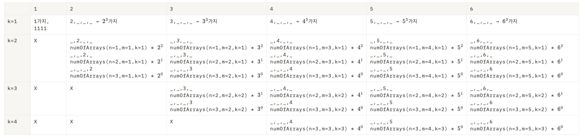
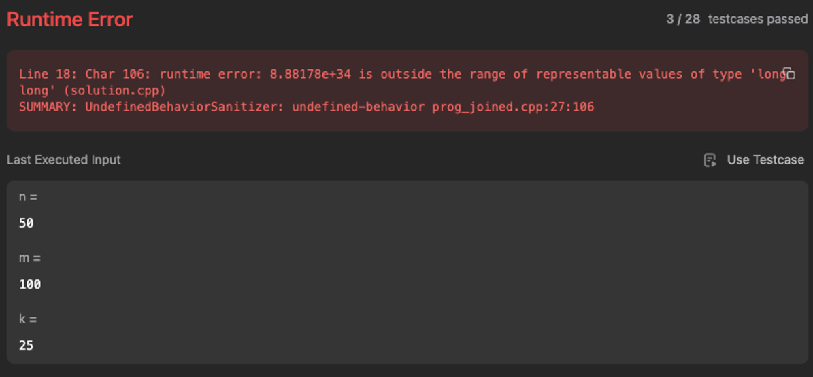
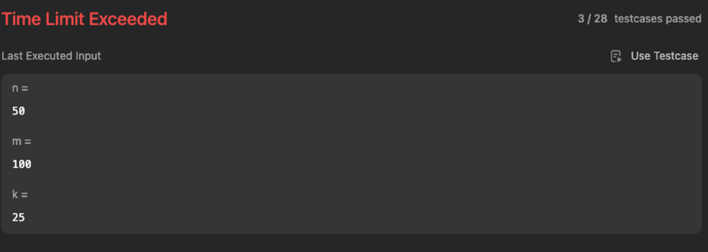
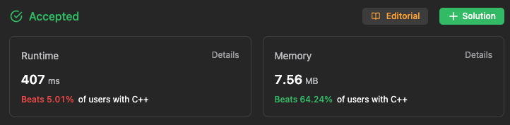

# 1420. Build Array Where You Can Find The Maximum Exactly K Comparisons
[LeetCode - 1420. Build Array Where You Can Find The Maximum Exactly K Comparisons](https://leetcode.com/problems/build-array-where-you-can-find-the-maximum-exactly-k-comparisons/description/?envType=daily-question&envId=2023-10-06)

## Intuition1

맨처음에는 

1. 중복조합
주어진 n과 m에 대해, ascending order을 가진 array의 갯수는 총 $n+m-1\choose m-1$ 이다.
2. 주어진 알고리즘에서 `search_cost`는 현재 maximum_value보다 더 큰 값을 만나게 되면 증가한다.즉, 우리는 k개의 peek를 만들어야한다.

위 두가지사실을 토대로, 우리는 중복조합에서 가짓수를 증가시키는 방식으로 해결하려 했다.

그러나 둘의 연관성이 크지 않다는것을 느꼈고, 무작정 n=4, m=6인 상황을 두고 답을 도출해보았다.

n=4, m=6인 상황에서, 각각의 k에 대해(1≤k≤m), array에 출현하는 최대값에 따른 조건을 만족하는 array의 가짓수를 보자



memoization 의 사상으로 접근하면 됨을 알 수 있다. 그래서 다음과 같은 memoization식을 세웠고,

1. numOfArrays(n, m ,k=1) = $\sum_{i=1}^mi^{n-1}$. (⇒ numOfArrays(n=1, m ,k=1) = m)
2. numOfArrays(n,m,k) = $\sum_{i=k}^m (\sum_{j=k-1}^{n-1}(numArrays(j,i-1,k-1)*i^{n-j-1}))$

그리고 numOfArrays가 0인상황까지 고려하여 프로그래밍하였다.

1. k > m
k가 m보다 크다면, k개의 peek를 만들 수 없기 때문에, 가능한 array는 없다.
2. k=0
n이 1보다 크고, m은 1보다 작을수 없기때문에 k=0이라면, 가능한 array는 없다.

## Approach1

우선은 그냥 brute force형식으로 구현해보았다.

```cpp
class Solution {
public:
    const long long MOD = 1000000007;

    int numOfArrays(int n, int m, int k) {
        if ( k > m || k == 0) return 0;
        if (n ==1 && k ==1 ) return m;
        if (k==1) {
            long long res = 0;
            for(int i = 1; i <= m; i++){
                res += static_cast<long long>(pow(i, n-1)) % MOD;
            }
            return (int)(res % MOD);
        }
        long long res = 0;
        for(int i = k; i <= m; i++){
            for(int j = k-1; j <=n-1; j++){
                res += ((static_cast<long long>(numOfArrays(j, i-1, k-1))%MOD) * (static_cast<long long>(pow(i, n-j-1))%MOD)) % MOD;
            }
        }
        return (int)(res%MOD);
    }
};
```

테스트케이스들은 통과했으므로, 로직자체는 틀리지 않았지만, `pow` 연산시, long long의 범위조차도 넘어버리는 문제가 발생하였다. 이를 위해서 $a^b \; mod \; MOD$ 함수를 구현했다.

<aside>
💡 **快速求幂!**

이때 “Exponentiation by squaring” 방식으로 구현하였다. 속도를 아주 조금 더 향상시킬 수 있을것이다.

</aside>

```cpp
long long mod_pow(long long a, long long b, long long MOD) {
        long long result = 1;
        while (b > 0) {
            if (b & 1) {
                result = (result * a) % MOD;
            }
            a = (a * a) % MOD;
            b >>= 1;
        }
        return result;
    }
```

그렇게 overflow문제는 해결했지만, 당연하게도 TLE가 떠버렸다.  


그래서 memoization을 활용해 보았지만, 그닥 만족스러운 결과는 얻지 못하였다.

```cpp
class Solution {
public:
    const long long MOD = 1000000007;

    int my_map[51][101][51] = {0};
    long long mod_pow(long long a, long long b, long long MOD) {
        long long result = 1;
        while (b > 0) {
            if (b & 1) {
                result = (result * a) % MOD;
            }
            a = (a * a) % MOD;
            b >>= 1;
        }
        return result;
    }

    int numOfArrays(int n, int m, int k) {
        if ( k > m || k == 0) return 0;
        if (n ==1 && k ==1 ) return m;
        if (k==1) {
            long long res = 0; 
            for(int i = 1; i <= m; i++){
                res = (res + mod_pow(i, n-1, MOD)) % MOD;
            }
            // int index = 100000 * n + 100 * m  + k;
            my_map[n][m][k] = (int)(res % MOD);
            return my_map[n][m][k];
        }
        long long res = 0;
        for(int i = k; i <= m; i++){
            for(int j = k-1; j <=n-1; j++){
                // int index = 100000 * j + 100 * (i-1) + k-1;
                res += 
                    my_map[j][i-1][k-1] ? 
                    (my_map[j][i-1][k-1] * (mod_pow(i, n-j-1,MOD))) % MOD 
                    : ((static_cast<long long>(numOfArrays(j, i-1, k-1))) * (mod_pow(i, n-j-1,MOD))) % MOD;
            }
        }
        // int index = 100000 * n + 100 * m  + k;
        my_map[n][m][k] = (int) (res%MOD);
        return my_map[n][m][k];
    }
};
```

그래서 dynamic programming 기법을 활용해보기로 했다…

## Intuition2

## Approach2

## Referenes

[LeetCode - The World's Leading Online Programming Learning Platform](https://leetcode.com/problems/build-array-where-you-can-find-the-maximum-exactly-k-comparisons/solutions/?envType=daily-question&envId=2023-10-06)