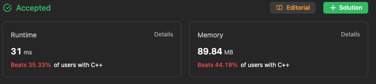

# 问题
[LeetCode - 4. Median of Two Sorted Arrays](https://leetcode.com/problems/median-of-two-sorted-arrays/description/)


## Intuition & Approach

처음에 보고 딱 든 생각은 “merge sort”이다.  

merge sort는 `divide and conquer` 사상을 가진 대표적인 알고리즘으로서, 정렬해야 할 배열을 같은 크기의 2개의 부분 배열로 분할한 후(Divide), 부분 배열들을 쌍으로 묶어 정렬시키면서 결합하는 방식이다. 자세한 것은 [reference를 참고](https://www.notion.so/4-Median-of-Two-Sorted-Arrays-99fcd920efd54456ab073c228300d0d3?pvs=21).

즉, two sorted array를 하나의 배열로 정렬시키는 과정을 포함하기때문에, 거기서 착안해서 우리가 원하는 median을 중간에 낚아 채면 된다. 

다음과같이 코드를 짤 수 있었다.

```cpp
class Solution {
public:
    int total_length;

    bool is_end(const int index){
        return (index == total_length/2) ? true : false;
    }

    double findMedianSortedArrays(vector<int>& nums1, vector<int>& nums2) {
        int m = nums1.size(); int n = nums2.size();
        int index1 = 0; int index2 = 0;
        total_length = m+n;
        if(total_length % 2){ // odd 
            while( !is_end(index1+index2) && index1 < m && index2 < n){
                nums1[index1] < nums2[index2] ? index1++ : index2++;
            }

            if( is_end(index1+index2) ){
                if (index1 == m){
                    return (double)nums2[index2];
                } else if (index2 == n){
                    return (double)nums1[index1];
                } else {
                    return nums1[index1] < nums2[index2] ? (double)nums1[index1] : (double)nums2[index2];
                }
            } else {
                if(index1 < m){
                    while (!is_end(index1+index2)){
                        index1++;
                    }
                    return (double)nums1[index1];
                } else {
                    while (!is_end(index1+index2)){
                        index2++;
                    }
                    return (double)nums2[index2];
                }
            }
        } else { //even
            double left = 0;
            while( !is_end(index1+index2) && index1 < m && index2 < n){
                if (nums1[index1] < nums2[index2]){
                    left = (double) nums1[index1];
                    index1++;
                } else {
                    left = (double) nums2[index2];
                    index2++;
                }
            }

            if(is_end(index1+index2)){
                if (index1 == m){
                    return ((double)nums2[index2] + left)/2;
                } else if (index2 == n){
                    return ((double)nums1[index1] + left)/2;
                } else {
                    return nums1[index1] < nums2[index2] ? ((double)nums1[index1] + left)/2 : ((double)nums2[index2] + left)/2;
                }
            } else {
                if(index1 < m ){
                    while (!is_end(index1+index2)){
                        left = nums1[index1];
                        index1++;
                    }
                    return ((double)nums1[index1] + left)/2;
                } else {
                    while( !is_end(index1+index2)){
                        left = nums2[index2];
                        index2++;
                    }
                    return ((double)nums2[index2] + left)/2;
                }
            }
        } 
    }
};
```



이때 한가지 간과하고 있는 사실이있었다.

> The overall run time complexity should be `O(log (m+n))`.
> 

요구사항은 로그시간안에 해결하라고 하였지만, 내가 구현한 방식은 $(m+n)/2$번 비교하기때문에, 총 시간복잡도가 $O(m+n)$이 된다. 

이건 생각보다 쉽게 해결할 수 있었는데, 주어진 배열이 이미 정렬되어 있으므로, index를 하나씩 증가시키는것이아닌, binary search 를 통해 더 큰 폭으로 증가 시키면 되었다.

예시를 들자면, 기존의 방식은 `nums1=[1,2,3,4,5]` , `nums2=[6,7,8,9,10]` 이 두 배열이 주어졌을때,
맨처음 1과 6을 비교하고, 그다음엔 2와 6, 또다시 3과6, 계속해서 5와6까지 비교할것이다.

하지만 우리가 만약 `nums1`에 6보다 큰 원소가 없다는것을 이미 안다면(더 정확하게는 `num1` 에서 6을 찾으려고 했을때의 index가 5인것을 안다면), 굳이 5번의 비교를 하지않고, 바로 `index1+=5` 를 수행했을것이다.

이를 토대로 다시 적은 알고리즘은 다음과 같다. (**TODO**)

```cpp
class Solution {
public:
    int total_length;

    bool is_end(const int index){
        return (index == total_length/2) ? true : false;
    }

    int binSearch(const vector<int>& arr, int start, int end, int target){
        // TODO : 
        // return arr[target];
    }
    double findMedianSortedArrays(vector<int>& nums1, vector<int>& nums2) {
        int m = nums1.size(); int n = nums2.size();
        int index1 = 0; int index2 = 0;
        total_length = m+n;

        if(total_length % 2){ // odd 
            while(!is_end(index1+index2) && index1 < m && index2 < n) {
                if( nums1[index1] == nums2[index2]) index1++;
                else {
                    int relative_pos_e2 = binSearch(nums1, index1, m, num2[index2]);
                    int relative_pos_e1 = binSearch(nums2, index2, n, num1[index1]);
                    if( relative_pos_e2 > relative_pos_e1){
                        index1 += relative_pos_e2;
                    } else {
                        index2 += relative_pos_e1;
                    }
                }
            }

            if( is_end(index1+index2) ){
                if (index1 == m){
                    return (double)nums2[index2];
                } else if (index2 == n){
                    return (double)nums1[index1];
                } else {
                    return nums1[index1] < nums2[index2] ? (double)nums1[index1] : (double)nums2[index2];
                }
            } else {
                if(index1 < m){
                    while (!is_end(index1+index2)){
                        index1++;
                    }
                    return (double)nums1[index1];
                } else {
                    while (!is_end(index1+index2)){
                        index2++;
                    }
                    return (double)nums2[index2];
                }
            }
        } else { //even
            double left = 0;
            while( !is_end(index1+index2) && index1 < m && index2 < n){
                if (nums1[index1] < nums2[index2]){
                    left = (double) nums1[index1];
                    index1++;
                } else {
                    left = (double) nums2[index2];
                    index2++;
                }
            }

            if(is_end(index1+index2)){
                if (index1 == m){
                    return ((double)nums2[index2] + left)/2;
                } else if (index2 == n){
                    return ((double)nums1[index1] + left)/2;
                } else {
                    return nums1[index1] < nums2[index2] ? ((double)nums1[index1] + left)/2 : ((double)nums2[index2] + left)/2;
                }
            } else {
                if(index1 < m ){
                    while (!is_end(index1+index2)){
                        left = nums1[index1];
                        index1++;
                    }
                    return ((double)nums1[index1] + left)/2;
                } else {
                    while( !is_end(index1+index2)){
                        left = nums2[index2];
                        index2++;
                    }
                    return ((double)nums2[index2] + left)/2;
                }
            }
        } 
    }
};
```

## Reference

- https://gmlwjd9405.github.io/2018/05/08/algorithm-merge-sort.html